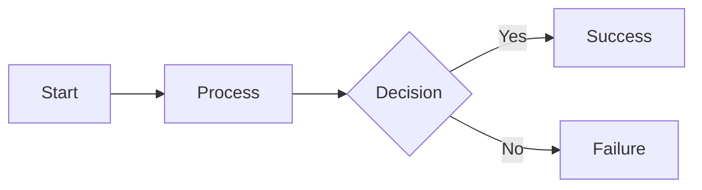

In short Segment Routing is about using the header to store explicit addresses of nodes through which the packed should pass through.

```
|  L2  |        IPv6 Header         |    Segment Routing Header   |  TCP / UDP  
|––––––––––––––––––––––––––––––––––––––––––––––––––––––––––––––––––––––––––––––
|  ..  | IPv6 DST1 | IPv6 SRC | ... | IPv6 DST2 | IPv6 DST3 | ... |    ....   
```

So if I 


```mermaid
sequenceDiagram
    participant R1
    participant R2
    participant R3
    participant R4
    R1 -> R2
    R2 -> R4
    R1 -> R3
    R3 -> R4

```

asdf


